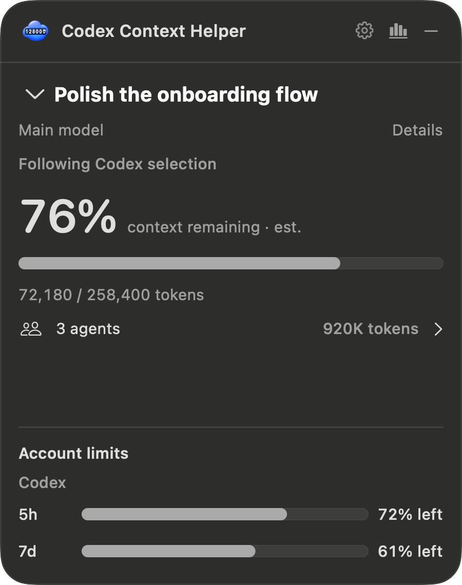
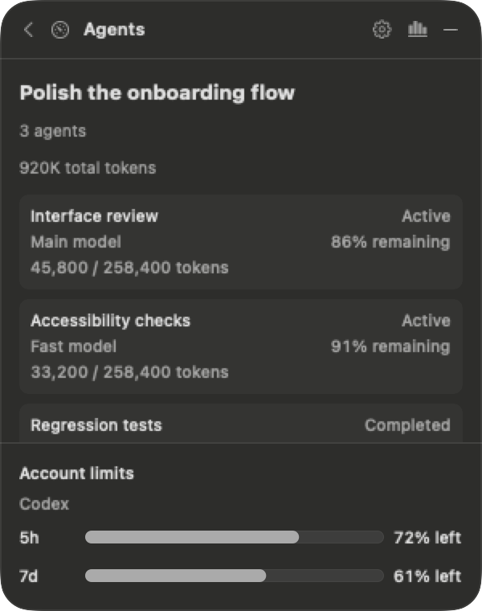
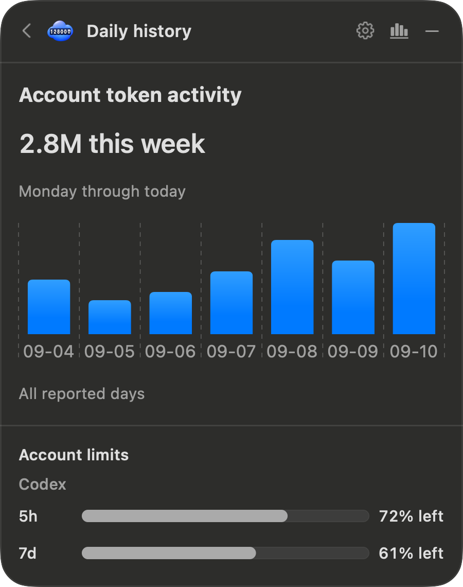

# Codex Context Helper

<p align="center"></p>

A small floating macOS companion for Codex. Keep an eye on context remaining, saved token usage, agents, and account limits without leaving your task.

**Why this exists:** I wanted an always-visible overview of context, tokens, agents, and account limits while working in Codex. I couldn't find a built-in view that put all of that together at a glance, so I made this little companion.

**Experimental · macOS 14+ · Swift 6 · MIT licensed**

This is an independent community project, not an OpenAI product and not affiliated with or endorsed by OpenAI. It is provided **as is, without warranty**. Readings may be incomplete, delayed or incorrect, and Codex updates can break compatibility. Do not rely on it for billing, critical decisions, or preventing context loss. Support and continued maintenance are not guaranteed.

> **A note from the human:** This is 100% vibe coded. I have not read any of the code. I did, however, have extremely specific opinions about the rounded corners.

## A compact view of your work

<p align="center">
  
  &nbsp;&nbsp;
  
  &nbsp;&nbsp;
  
</p>

*Actual native views rendered with synthetic demo data. No real tasks or account information are shown.*

- **Context remaining:** one percentage, plus saved tokens / context window.
- **Agent overview:** a compact total opens a separate page with each agent's own context and model.
- **Account limits:** returned quota windows stay visible beneath the task view.
- **Recent tasks:** compare a small set of tasks and inspect their counters.
- **Optional costs:** show credits or USD only when Codex supplies them; missing data is never zero.
- **Quiet updates:** watch saved session changes, refresh periodically, and identify stale readings.

## Requirements

- macOS 14 or later. Full manual coverage across supported macOS versions is still pending.
- Xcode with Swift 6 and its command-line tools selected. Development validation used Xcode 26.6.
- **Codex CLI 0.153.4**, installed separately and signed in. The reader currently checks this exact version; other versions are not silently accepted.
- A local Codex session store. Cloud-only task contexts may not be available.

No third-party Swift packages are required. Build scripts use installed tools and do not install dependencies. CI does not need Codex, account credentials or Accessibility permission.

## Build and run

```sh
git clone https://github.com/ademartini/codex-context-helper.git
cd codex-context-helper
scripts/check_prerequisites.sh
scripts/test_unit.sh
scripts/package.sh
open dist/development/CodexContextHelper.app
```

The default package is an **ad hoc signed local development build**, not a notarized installer. Build from source you trust. Do not disable macOS security protections to launch a download. For another build, choose a fresh destination:

```sh
PACKAGE_OUTPUT_DIR="$PWD/dist/next-build" scripts/package.sh
```

You can also open `CodexContextHelper.xcodeproj` and run the `CodexContextHelper` scheme. See [development and release checks](docs/verification.md) for test coverage and optional signing/notarization.

## First launch

1. Open Settings from the panel or menu-bar item.
2. Review and approve your installed Codex executable. The app checks its file identity and supported version; this does not establish publisher authenticity. Approve only a trusted installation.
3. Choose **Follow latest activity**, or choose a recent task to pin it. Accessibility permission is not required for these modes.
4. Drag the panel into place. Choose a task from the dropdown, open Agents or daily history, or use the menu-bar item to restore a hidden panel.

The task picker defaults to **Follow latest activity**. Choose a recent task to pin it for the current launch, even if newer tasks appear; choose Follow latest activity to resume automatic tracking. Pins are kept in memory and reset on quit.

Agents and daily history open their own pages with Back navigation at the same panel size. Details and Settings can grow downward while preserving the top-right anchor. There is no multi-section expanded dashboard.

Rebuilding an ad hoc signed app changes its identity. If Accessibility is enabled in System Settings but the app cannot use it, remove only this app's entry and add the exact rebuilt app again. Keep it at a stable path. Launch at login is optional and depends on a location/signature accepted by macOS; it may be unavailable for development builds.

## What the numbers mean

The remaining percentage follows the [Codex 0.153.4 calculation](https://github.com/openai/codex/blob/rust-v0.153.4/codex-rs/tui/src/token_usage.rs), using the latest saved response total and reported window, subtracting a 12,000-token baseline, and rounding to a whole percentage. The raw tokens/window line includes that baseline, so it is not the exact inverse of the percentage. **Live parity checks remain incomplete.**

Cumulative token activity counts tokens across responses. It is separate from current context occupancy and is not a bill. Cached input is already part of input; reasoning output is already part of output. These are not added twice.

Agents use their own saved counters, models and windows. The summary excludes the main task and identifies partial reporting. Compaction and recorded model changes clear the preceding context reading until a new valid counter arrives. Changes cannot be reflected before Codex records them.

Saved-file events are debounced; fallback context/task discovery checks run every five seconds. Selection checks run every two seconds; account, cost and agent discovery checks run about every thirty seconds. Foreground/reconnect events refresh data. These are target intervals, not freshness guarantees; ongoing responses and unavailable services can delay updates.

Per-task cost/credit estimates depend on what Codex exposes for the task's billing route. They may be absent for every task. The app does not invent prices, calculate an invoice, or claim combined agent costs are verified.

## Privacy and limitations

The helper reads local session files and uses Codex's authenticated app-server. It has no direct network client or analytics SDK, but the Codex child may contact its services and maintain its own local state. Optional executable discovery can run your login shell's startup files. The app runs outside App Sandbox and optional Accessibility access is powerful; grant it only to a build you trust.

Task titles and usage appear on screen. The helper stores preferences and executable approval locally, not copies of session content. See [privacy](PRIVACY.md) for details and redact screenshots before sharing.

Live percentage parity, Spaces/full-screen behavior, VoiceOver, login registration and sustained resource use still need broader manual validation. An unavailable reading is not evidence of zero usage. See [known validation limits](docs/verification.md).

## Contributing and security

See [contributing](CONTRIBUTING.md), [community expectations](CODE_OF_CONDUCT.md), and the [changelog](CHANGELOG.md). Bug reports should contain synthetic or redacted examples, never raw session logs or credentials. Report vulnerabilities through [private security reporting](SECURITY.md).

Licensed under the [MIT License](LICENSE), including its warranty disclaimer and limitation of liability. Codex and OpenAI names belong to their respective owners; the project name describes compatibility only.
